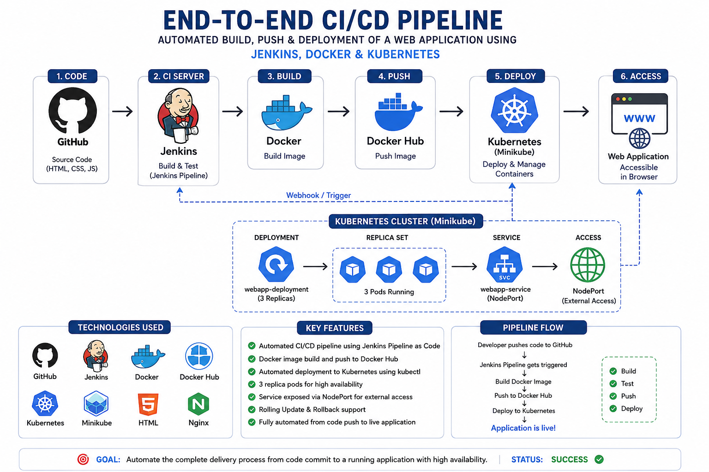

# 🚀 End-to-End CI/CD Pipeline with Jenkins, Docker & Kubernetes

An end-to-end DevOps project that demonstrates the automated build, containerization, image publishing, and Kubernetes deployment of a web application.

## 🏗️ Architecture



### Pipeline Architecture

```text
GitHub
   │
   │ Webhook / Trigger
   ▼
Jenkins
   │
   ├── Build & Test
   │
   ▼
Docker
   │
   ├── Build Docker Image
   │
   ▼
Docker Hub
   │
   ├── Store Docker Image
   │
   ▼
Kubernetes / Minikube
   │
   ├── Deployment
   │      └── Application Pods
   │
   └── Service
          └── NodePort
               │
               ▼
        Web Application
```

## 🛠️ Technologies Used

* **GitHub** — Source code management
* **Jenkins** — CI/CD automation
* **Docker** — Containerization
* **Docker Hub** — Container image registry
* **Kubernetes** — Container orchestration
* **Minikube** — Local Kubernetes environment
* **HTML / CSS / JavaScript** — Web application
* **Nginx** — Web server

## 🔄 CI/CD Pipeline Flow

```text
Developer pushes code
        ↓
      GitHub
        ↓
Jenkins pipeline triggered
        ↓
   Build & Test
        ↓
 Build Docker Image
        ↓
 Push Image to Docker Hub
        ↓
 Deploy to Kubernetes
        ↓
 Kubernetes Service
        ↓
 Web Application
```

## ⚙️ Project Components

### 🐳 Docker

The `Dockerfile` defines the container image used to package the web application and its required environment.

### 🔧 Jenkins

The `Jenkinsfile` defines the CI/CD pipeline and automates the build, image creation, image publishing, and Kubernetes deployment workflow.

### ☸️ Kubernetes

The project uses Kubernetes manifests to deploy and expose the application.

* `deployment.yaml` — Defines the application Deployment and Pods.
* `service.yaml` — Defines the Kubernetes Service used to expose the application.

## 📂 Project Structure

```text
end-to-end-cicd-jenkins-docker-kubernetes/
│
├── images/
│   └── architecture.png
│
├── Dockerfile
├── Jenkinsfile
├── deployment.yaml
├── service.yaml
├── index.html
├── timer.html
├── tooplate-2167-orbital-script.js
└── tooplate-2167-orbital-style.css
```

## 🔥 Key Features

* Automated CI/CD workflow
* Jenkins Pipeline as Code
* Docker image creation
* Docker Hub image publishing
* Kubernetes deployment
* Kubernetes Service exposure
* Multiple application replicas
* GitHub source-code integration
* Containerized web application

## 🎯 Project Objective

The objective of this project is to demonstrate how a web application can move through a DevOps delivery workflow:

```text
Code → Build → Containerize → Push → Deploy → Access
```

The project focuses on practicing **CI/CD automation, containerization, container registries, and Kubernetes deployment**.

## 📚 What I Learned

Through this project, I practiced:

* CI/CD pipeline design
* Jenkins Pipeline configuration
* Docker image creation
* Docker Hub workflow
* Kubernetes Deployments
* Kubernetes Services
* Minikube
* Git and GitHub workflows
* Deployment troubleshooting
* Infrastructure and application documentation

## 👨‍💻 Author

### Srikanth D

**DevOps & Cloud Enthusiast**

AWS | Linux | Git | Docker | Jenkins | Kubernetes | CI/CD

---

⭐ **Learning • Building • Automating**
